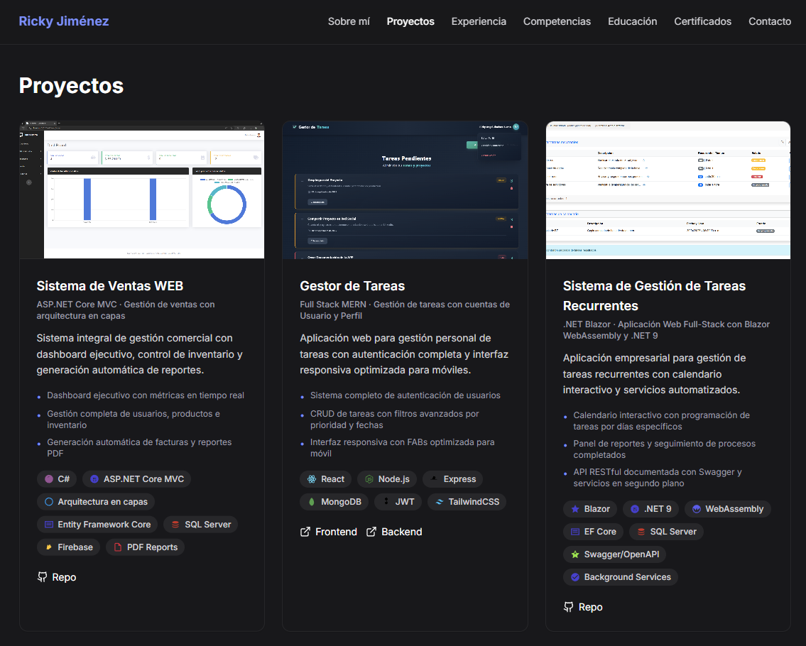

# 🚀 Portfolio Web - Ricky Angel Jiménez Bueno

Un portafolio web moderno, seguro y responsivo construido con las últimas tecnologías web. Este proyecto presenta mis habilidades, experiencia, proyectos y certificaciones de manera profesional e interactiva, con un enfoque en rendimiento, seguridad y experiencia de usuario.




## ✨ Características - [Demostración](https://portafolio-web-rajb.netlify.app/)

- **🎨 Diseño Moderno**: Interfaz limpia y profesional con animaciones suaves
- **📱 Totalmente Responsivo**: Optimizado para dispositivos móviles, tablets y escritorio
- **🌟 Animaciones Interactivas**: Implementadas con Framer Motion
- **⚡ Rendimiento Optimizado**: Construido con Vite 7 para carga ultrarrápida
- **🛡️ Seguridad Reforzada**: Headers HTTP de seguridad, CSP estricto, protección anti-clickjacking
- **🔒 Protección de Datos**: Email ofuscado contra bots, enlaces externos seguros
- **🎯 Type-Safe**: Desarrollo con TypeScript para mayor confiabilidad
- **📧 Contacto Seguro**: Sistema de contacto con protección anti-scraping
- **🔍 SEO Optimizado**: Meta tags y estructura semántica

## 🛠️ Tecnologías Utilizadas

### Core Technologies
- **React 19** - Biblioteca moderna para interfaces de usuario reactivas
- **TypeScript 5** - Superset de JavaScript con tipado estático
- **Vite 7** - Build tool de próxima generación, ultrarrápido
- **Tailwind CSS 4** - Framework de CSS utility-first con nuevas capacidades
- **Framer Motion 12** - Biblioteca avanzada de animaciones para React

### UI & Icons
- **lucide-react** - Iconos modernos y consistentes
- **react-type-animation** - Animaciones de texto tipo máquina de escribir

### Security & Best Practices
- **Netlify Security Headers** - CSP, HSTS, X-Frame-Options, Permissions-Policy
- **Email Obfuscation** - Protección contra scraping de bots
- **Secure External Links** - rel="noopener noreferrer" en todos los enlaces

### Development Tools
- **ESLint 9** - Linter moderno para TypeScript/React
- **Vite Plugin React** - Plugin oficial optimizado para React

## 🚀 Instalación y Uso

### Prerrequisitos
- Node.js (versión 18 o superior)
- npm o yarn

### Instalación

1. **Clona el repositorio**
   ```bash
   git clone https://github.com/tu-usuario/portafolio-web.git
   cd portafolio-web
   ```

2. **Instala las dependencias**
   ```bash
   npm install
   ```

3. **Ejecuta el servidor de desarrollo**
   ```bash
   npm run dev
   ```

4. **Abre tu navegador**
   ```
   http://localhost:5173
   ```

### Scripts Disponibles

```bash
# Servidor de desarrollo
npm run dev

# Construir para producción
npm run build

# Vista previa de la construcción
npm run preview

# Ejecutar linter
npm run lint

# Verificar tipos TypeScript
npm run type-check
```

## 📁 Estructura del Proyecto

```
portafolio-web/
├── public/
│   ├── assets/           # CVs y documentos
│   ├── projects/         # Imágenes de proyectos
│   ├── favicon.svg       # Icono del sitio
│   └── _redirects        # Configuración de redirects
├── src/
│   ├── components/       # Componentes de React (TypeScript)
│   │   ├── About.tsx
│   │   ├── Certificates.tsx
│   │   ├── Contact.tsx
│   │   ├── Education.tsx
│   │   ├── Experience.tsx
│   │   ├── Footer.tsx
│   │   ├── Hero.tsx
│   │   ├── Layout.tsx
│   │   ├── Navbar.tsx
│   │   ├── Projects.tsx
│   │   ├── Skills.tsx
│   │   ├── TechIcon.tsx
│   │   └── ui/           # Componentes UI reutilizables
│   │       ├── ObfuscatedEmail.tsx  # Protección de email
│   │       ├── ProjectCard.tsx
│   │       ├── SectionContainer.tsx
│   │       └── SectionHeading.tsx
│   ├── data/             # Datos tipados
│   │   ├── certificates.ts
│   │   ├── education.ts
│   │   ├── experience.ts
│   │   ├── projects.ts
│   │   └── skills.ts
│   ├── hooks/            # Hooks personalizados
│   │   └── useScrollspy.tsx
│   ├── lib/              # Utilidades y configuraciones
│   │   └── animations.ts
│   ├── types/            # Definiciones de tipos TypeScript
│   │   └── index.ts
│   ├── App.tsx           # Componente principal
│   ├── main.tsx          # Punto de entrada
│   └── index.css         # Estilos globales
├── helpers/              # Funciones auxiliares JavaScript
│   ├── animations.js
│   ├── constants.js
│   └── utils.js
├── .env.example          # Plantilla de variables de entorno
├── netlify.toml          # Configuración de seguridad Netlify
├── eslint.config.js      # Configuración de ESLint
├── tsconfig.json         # Configuración de TypeScript
├── vite.config.ts        # Configuración de Vite (TypeScript)
└── package.json          # Dependencias del proyecto
```

## 🎨 Secciones del Portfolio

- **🏠 Hero**: Presentación principal con animación de texto
- **👨‍💻 Sobre Mí**: Información personal y profesional
- **🚀 Proyectos**: Showcase de proyectos destacados
- **💼 Experiencia**: Historial laboral y profesional
- **🛠️ Habilidades**: Tecnologías y herramientas
- **🎓 Educación**: Formación académica
- **📜 Certificaciones**: Cursos y certificaciones
- **📞 Contacto**: Formulario de contacto y redes sociales

## 🌐 Despliegue

### Netlify (Recomendado)
Este proyecto está optimizado para Netlify con configuración de seguridad incluida:

1. Conecta tu repositorio de GitHub con Netlify
2. Configura el comando de construcción: `npm run build`
3. Directorio de publicación: `dist`
4. El archivo `netlify.toml` incluye:
   - Headers de seguridad HTTP
   - Cache optimizado para assets
   - Redirects para SPA
   - Configuración para deploy previews

**Validar seguridad post-deploy:**
- [SecurityHeaders.com](https://securityheaders.com) - Debería dar A+
- [Mozilla Observatory](https://observatory.mozilla.org) - Verificar CSP

### Vercel
```bash
npm install -g vercel
vercel --prod
```

### GitHub Pages
```bash
npm run build
# Sube el contenido de la carpeta 'dist' a tu repositorio gh-pages
```

## 🔧 Personalización

### Modificar Datos Personales
Edita los archivos TypeScript en la carpeta `src/data/`:
- `projects.ts` - Tus proyectos
- `experience.ts` - Experiencia laboral
- `skills.ts` - Habilidades técnicas
- `education.ts` - Formación académica
- `certificates.ts` - Certificaciones

Todos los archivos están tipados para evitar errores y mejorar la experiencia de desarrollo.

### Cambiar Colores y Estilos
Los estilos están definidos en `src/index.css` y utilizan Tailwind CSS 4. Puedes personalizar:
- Colores primarios
- Tipografías
- Espaciados
- Animaciones

### Configurar Variables de Entorno
1. Copia `.env.example` a `.env`
2. Configura tus claves API (si usas servicios externos como EmailJS)
3. Solo las variables con prefijo `VITE_` son accesibles en el frontend

### Añadir Nuevas Secciones
1. Crea un nuevo componente TypeScript en `src/components/`
2. Define los tipos necesarios en `src/types/`
3. Importa y añade el componente en `App.tsx`
4. Actualiza la navegación en `Navbar.tsx`

## 📈 Características Técnicas

### Performance
- Optimizado con lazy loading y code splitting
- Build ultrarrápido con Vite 7
- Cache inmutable para assets estáticos
- Imágenes lazy loading nativas

### Seguridad (Security Score: A+)
- **Content Security Policy (CSP)** estricto pero funcional
- **HSTS** con preload para forzar HTTPS
- **X-Frame-Options: DENY** contra clickjacking
- **Permissions-Policy** bloqueando APIs innecesarias
- **Cross-Origin Policies** para protección adicional
- Email ofuscado contra bots de scraping
- Enlaces externos con `rel="noopener noreferrer"`

### Code Quality
- **Type Safety** completo con TypeScript 5
- **Clean Code**: Estructura modular y componentes reutilizables
- **Responsive**: Mobile-first design
- **Animations**: Smooth animations con Framer Motion 12
- **Accesibilidad**: Cumple con estándares WCAG 2.1
- **SEO**: Meta tags optimizados y estructura semántica

## 🤝 Contribuciones

Las contribuciones son bienvenidas. Por favor:

1. Fork el proyecto
2. Crea una rama para tu feature (`git checkout -b feature/AmazingFeature`)
3. Commit tus cambios (`git commit -m 'Add some AmazingFeature'`)
4. Push a la rama (`git push origin feature/AmazingFeature`)
5. Abre un Pull Request

## 📝 Licencia

Este proyecto está bajo la Licencia MIT. Ver el archivo `LICENSE` para más detalles.

## 📞 Contacto

**Ricky Angel Jiménez Bueno**
<!-- - Portfolio: [tu-portfolio.com](https://tu-portfolio.com) -->
- LinkedIn: [linkedin.com/in/tu-perfil](www.linkedin.com/in/ricky-angel-jimenez-bueno-52659928a)
- GitHub: [github.com/tu-usuario](https://github.com/xfiberex)
- Email: rickyjimenez1820@gmail.com

## 🙏 Agradecimientos

- [React](https://reactjs.org/) - Biblioteca de JavaScript
- [Vite](https://vitejs.dev/) - Build tool
- [Tailwind CSS](https://tailwindcss.com/) - CSS Framework
- [Framer Motion](https://www.framer.com/motion/) - Animation library
- [Heroicons](https://heroicons.com/) - Beautiful hand-crafted SVG icons
- [Lucide](https://lucide.dev/) - Beautiful & consistent icon toolkit

---

⭐ Si te gusta este proyecto, ¡dale una estrella en GitHub!